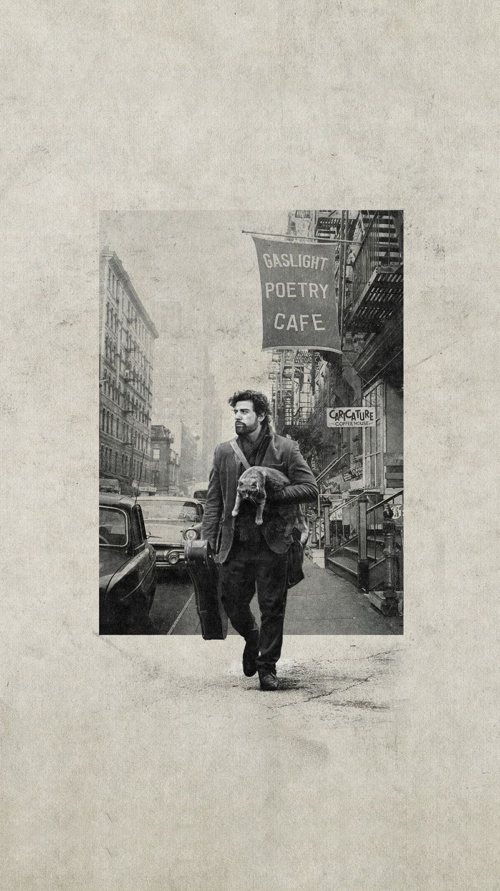

我的踏板车的生产厂家名字叫林海，感觉是个很好听、有画面感的名字。令人想起当初在上海经常看到的一条路的名字，林海公路。

上海似乎有很多路的名字会叫xx公路，而不是简单的xx路。像林海公路、沪南公路、沪奉公路、大叶公路等等。林海公路我只走过一两次，但经常能在路牌上看到这条路的名字。每次看到，都会不自觉脑补一条针叶林中的无尽而孤独的路。

虽然实际上的林海公路景色完全普普通通。

回到北京搬到东坝乡居住之后，门口那条路叫作醉公村路，大约是这里曾经有个叫醉公村的地方。网上查到了该村的概况：

> 位於朝陽區東北部。東北起單[店西村](https://www.easyatm.com.tw/wiki/店西村)，西至東崔家村，西北起七棵樹西街，南至[姚家園村](https://www.easyatm.com.tw/wiki/姚家園村)。村以墳得名。
> 村南原有一座第四[代睿](https://www.easyatm.com.tw/wiki/代睿)親王塞勒墓。墓主系睿親王多爾袞的嗣曾孫，豫親王多鐸的嫡曾孫，康熙四十七年（1708）襲輔國公，卒於雍正七年（1729），乾隆四十三年（1768）追封睿親王。其生前嗜酒，時常帶醉上朝，該人為人耿直，人稱“醉公”。醉公墳外有石牆，牆內占地三十畝。內有藍色磚牆，宮門三間，院內僅有台一座，上邊方磚墁地。寶頂別具一格，呈酒罈子狀，頂部置酒杯一個。旁有側福晉高氏墓。因醉公塞勒有十子，後裔較多，醉公墳的北側和西側還有六處墳。西邊緊挨著醉公墳的兩座[墳院](https://www.easyatm.com.tw/wiki/墳院)，坐東向西，北邊的一座是醉公塞勒側福晉高氏所生第五子輔國功宜布墓。功宜布，乾隆十一年二月十九日卒，享年三十三歲，謚恪勒。同樣被追封信郡王、睿親王。南墳院稱“花欄”，與西邊其他墳地屬於另一宗支，有榮七爺、忠八爺等稱謂。北連連墳院是醉公之佟、劉、王、韓四妾和阿哥墳地。民國二十年（1931）前後，有盜墓匪到醉公墳活動，但未盜開。民國二十七年（1938）醉公墳被盜。1966年醉公寶頂被[平毀](https://www.easyatm.com.tw/wiki/平毀)。
>
> 摘录自中文百科知识网 [醉公村](https://www.easyatm.com.tw/wiki/%E9%86%89%E5%85%AC%E6%9D%91)

但我并不关心这个名字的来历，而是经常把醉公村路错看成醉村公路。

醉公村路是普普通通的一个名字，而醉村公路，则令人充满遐想。

令人想起科恩兄弟的那部《醉乡民谣》。

或者更好听的是，醉乡公路？