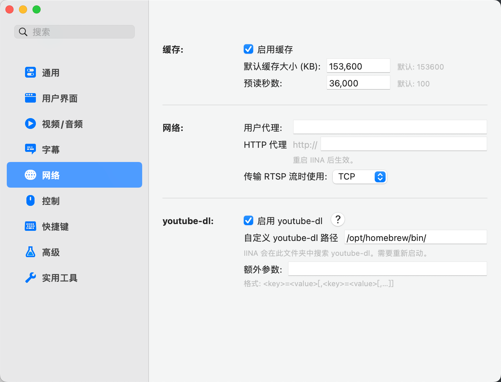

日常使用的操作系统切换到macOS后，需要找个新的播放器，经过一番对比决定使用 [IINA](https://iina.io/)这个优秀的开源播放器。调整设置过程中意外发现这个播放器还支持调用youtube-dl，从而实现在本地播放器播放网页视频的效果，只要youtube-dl支持的视频源，应该就都支持。



使用方法很简单，在设置/网络/youtube-dl这里填写自定义的youtube-dl路径即可，可以先在终端中使用用`which youtube-dl`命令查看youtube-dl的路径。我的设备上的路径是/opt/homebrew/bin/。

设置好之后测试了一下，播放B站的视频没有问题，然而播放YouTube视频缓冲速度过慢，完全不可用。其实之前用youtube-dl下载视频时就发现了这个问题，应该是YouTube进行了某种限制，所以转而使用yt-dlp下载。但IINA播放器似乎仅支持youtube-dl，于是填入yt-dlp的路径并不起作用。

联想到之前有搜到过youtube-dl调用aria2从而实现多线程下载的教程，而IINA的配置里也可以对youtube-dl设置额外参数，理论上可以在这里设置一下。经过一番操作失败了。

后来找到了[这个帖子](https://github.com/iina/iina/issues/3502) ，发现可以对通过简单的命令使IINA加入对yt-dlp的支持。严格来说yt-dlp跟youtube-dl是同一个东西，命令看上去大意是创建一个youtube-dl的目录与yt-dlp的链接，这样IINA调用youtube-dl时会被链接到yt-dlp，从而实现调用yt-dlp。

命令如下：

```
$ brew uninstall youtube-dl
$ brew install yt-dlp
$ ln -s /opt/homebrew/bin/yt-dlp /opt/homebrew/bin/youtube-dl
```

设置之后实测可以流畅播放YouTube视频了。