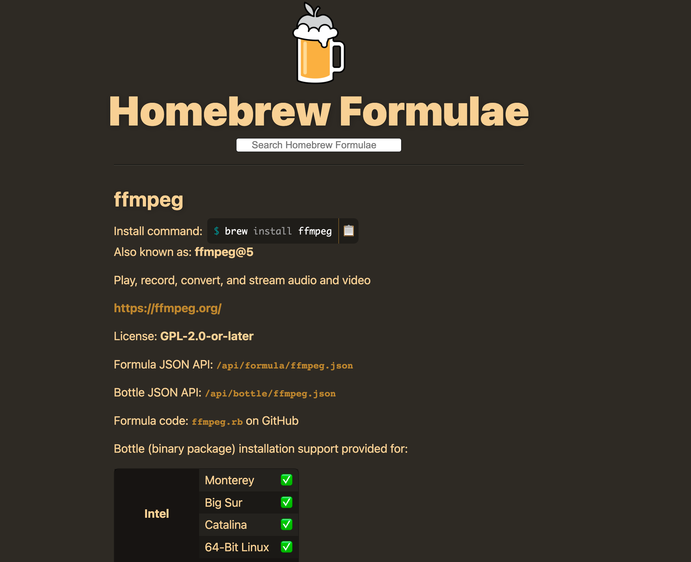

## 如何下载YouTube视频on macOS

之前在win上折腾过一次，简单记录了下。现在换了操作系统，方法仍然是使用yt-dlp来下载，只是安装方式略微不同。

#### 安装homebrew

访问 [homebrew官网]([The Missing Package Manager for macOS (or Linux) — Homebrew](https://brew.sh/)),按照网页上的指示安装homebrew。

```
/bin/bash -c "$(curl -fsSL https://raw.githubusercontent.com/Homebrew/install/HEAD/install.sh)"
```

#### 安装ffmpeg

YouTube上的音视频是分离的文件，故使用yt-dlp下载下来的文件需要依赖ffmpeg进行合成。在 [homebrew]([The Missing Package Manager for macOS (or Linux) — Homebrew](https://brew.sh/))网页的搜索框输入ffmpeg，可获得ffmpeg的下载安装命令，复制到终端运行。



#### 安装yt-dlp

访问[yt-dlp的GitHub页面]([yt-dlp/yt-dlp: A youtube-dl fork with additional features and fixes (github.com)](https://github.com/yt-dlp/yt-dlp))以获得安装命令

```
brew install yt-dlp/taps/yt-dlp
```

复制到终端运行，等待安装完成即可。