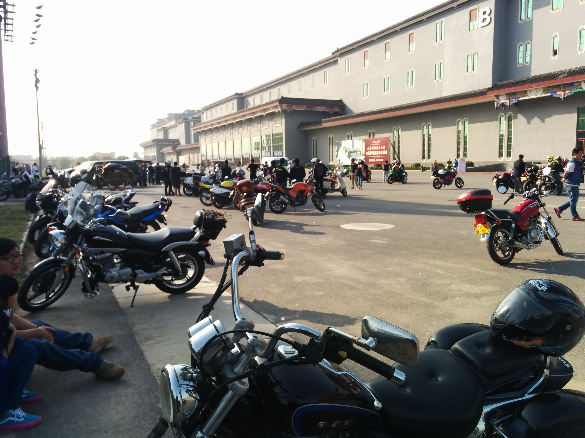

吾友小李的师父曾经说她是**真正喜欢骑车**的人，5年来她一直坚持骑车，用行动证明这一点。对于这个说法， 小李本人的意见是“喜欢的东西也谈不上坚持”。放在其它方面这句话可能没什么问题，然而在国内大型城市几乎全部对摩托车或禁或限的现实下，就真的需要坚持，才能继续骑下去。

上周一（2019年1月21日）早上骑车去上班，刚出门两分钟就在同济大学门口被警察摁下，扣了3分以及两百块钱，放我走人了。这是我本个计分周期第二次、骑车生涯第四次因违反机动车禁行标志而被地面交警处罚，在下个计分周期到来之前我还有1次被处罚的机会。

怂了，我不是一个真正喜欢骑车的人。

**源起**

第一次骑摩托车是几岁已然不记得了，大约是上初中一二年级的样子。有一天我爹先斩后奏买了一辆弯梁摩托车回家，无需离合就能挂挡，排量110cc，油箱只能加10多块钱的油。我爹有没有被我娘骂一顿不记得了，只记得那天可能是在我晦暗的青少年时代少有的兴奋的一天。堂弟会骑摩托车，带我出去遛了一圈稍做讲解，然后换他在后座我骑上去，从此开启了骑车生涯。

在我们老家是没有禁摩这回事的，摩托车作为一种比汽车便宜的代步工具，在大家都还买不起汽车的年代可谓遍地都是，虽然多数骑手们也怕遇到警察，但主要出于证照不够齐全。当然父母并不赞成我骑车的行为，虽说没有强制禁止，但终归不想制造冲突，多数时候只能趁父母午睡时偷偷出去骑一会儿。有时候骑去铁路边上看看火车，有时候则只是随便绕几圈。

高中是寄宿学校，开始时每4周回家一次，后来应教育局要求改为每两周回家一次，平时没有出校门的机会和时间，那几年几乎可以说与摩托车绝缘了，一年能骑到车的次数屈指可数。有一年寒假期间，某天家有客人陪他喝了一点啤酒。恰逢父亲生病需要替他去隔壁村办一点事情，车子在越来越坑坑洼洼的路上逐渐失去控制，横向翻了几个跟头之后停在马路当中。翻滚的过程中我并没有脱离车子，但是也基本没有受伤，扶起车子发现除了两个反光镜摔碎了似乎车子一切正常，就骑上继续去办事情了。

大概是从那次开始对酒精产生了敬畏，从此但凡沾酒绝对不骑车。

**重拾兴趣**

念大学时我第一次离开老家来到北京，认识了小李，开始注意到她大约是因为我们同样使用少见的黑莓手机，后来才知道她是个机车少女。此后我能重拾骑车这个爱好，基本是靠她的支持，不论精神上还是物质上。

那个时候我爹他老人家基本放弃了家里那辆摩托车，因为其在农村的实用性不如电动三轮车，另外可能也源于年纪大了。于是那辆车子唯一被骑的机会就是每年寒暑假我回家的那几天。我经常跟我爹说没事骑一下不然车子容易坏掉，但他似乎除了三轮车坏掉时再也没有骑过摩托车。

令人惊喜的是，在大学的四年里，每次回家总能成功把那辆掩埋在灰尘中的摩托车发动起来，尽管有时需要花费很大的力气。于是又可以骑着去走曾经溜达过无数次的路线，在雪地中撒个野。现在想起来路程真的很短，十几分钟就能骑完一圈。

与此同时在北京，我并没有一辆属于自己的摩托车，只能蹭小李的车子骑。

印象比较深刻的两件事情，都跟一辆使命特殊的车子有关，我们称它为 **狸猫**。

**其一：大蕉营救行动**

前面我说自己并不是一个真正喜欢骑车的人，跟小李一比就很明显了。作为一个女生，在骑车这件事情上所面临的家庭压力显然要比男生来得大许多，但这从未有效阻止她骑车。

大蕉应当是她在大学期间的第二辆车，一辆黄色R9踏板，在无数次与其父亲的抗争中失败，被锁在小区里禁止再骑。她想出了一招狸猫换太子，去废品收购站买了一辆接近报废的R9，收拾到能骑之后趁父亲不在家，将这辆车喷涂成黄色，替换掉楼下的大蕉。

我大概参与了这次行动的后半程，同她一起去遥远的通州把狸猫车骑回西城，并一起将大蕉换了出来。彼时正赶上北京筹备或者举办十八大，每个路口都有警察的样子，我们遇到警察就拐以至于花了比正常更多的时间，其间还因为躲一辆突然窜出的自行车而摔倒，摔伤了她的手指。一个漫长而刺激的下午。

那个时候大致明白了，什么是热爱骑车。

**其二：平安大道的延伸**

狸猫被骑回西城之后并没有马上去营救大蕉，而是暂时停在大学的门口，营救行动需要等待合适的时机。车子太过破旧，回到学校又难以启动了，我从小李那里要来车钥匙，表示可以找机会去试试能不能踹着。

某天晚上舍友们在宿舍喝酒，我以待会儿要骑车为由拒绝参与。酒过三巡之后，一向对摩托车不感兴趣的卅哥问我能不能骑车带他出去溜达一圈，我欣然同意，虽然那时对于能不能成功踹着车子心里并没有底。

好在狸猫挺争气的，大概没费什么力气就踹着了，带卅哥拐上平安大街一路向东骑。大概是酒精助兴加上第一次乘坐摩托车，卅哥显得很兴奋，受他感染我们一起像傻逼一样大声唱歌，然后被灌一嘴土。

北京土真的很大。

听说现在好一些了。

后来拐到朝阳门桥，在路口遇到警车，仓惶拐弯儿跑路。结果晚上辨识不清方向，沿着一条错误的路线骑了一会儿才发现不对。三四月份还挺冷，没穿什么衣服的我们都被冻得瑟瑟发抖。好在手机上已经有地图了，加上北京方方正正的并不容易迷路，找回方向的我们一边往回骑一边被冻得骂娘。

东直门的711便利店解救了我们，进去蹭了一会儿空调终于缓过来。在关于北京的回忆里，跟便利店相关的总是温暖的，可能这就是我愿意经常在凌晨两三点骑二十分钟自行车跑到别人家学校门口的711便利店去买东西的原因。

**第一辆属于自己的摩托车**

工作以后的第一笔收入，不到半个月的工资，加上没花完的奖学金，买了一辆没有手续的二手铃木太子。

所谓无知者无畏，从顺义去三元桥取车，竟然穿个T恤就去了，也没有头盔。骑车回去的时候走着走着就迷路了，毕竟常年乘坐地铁的我对地面太不熟悉。心说没有实时导航这么骑老得走错路，不如干脆上高速。一路杀到顺义下高速，走错路的机率大大降低。

搁今天我肯定不敢这么干了，还是命重要，骑车不戴头盔护具是很容易死的。

车子买来不久后参加了一次人数颇多的跑山活动，还没出城就在高架路上遇到查车，在队友们的掩护之下仓惶逃离。一个有趣的细节是，这次跑山队伍中有个穿着公交司机工服的小哥，骑的是川崎小忍者。考虑到骑摩托车的群体中有很大一部分人是装逼犯，能这么穿着就来跑山的实属难得。问了一下是家里不让跑山，只好穿上工服谎称上班出来的。

大概，骑车的人或多或少都遇到过家里的阻拦吧。

第一次跑山之后不敢再穿越北京城到西边去跑山，平时只能从顺义向北奔密云或者怀柔，也不怎么参加集体活动。

只有晚上才敢进城。

第二年秋天，这辆车在一次事故中报废。一个月以后拆掉手臂上的外固定架，回到事发地点，已经完全看不出痕迹，车子的尸体也无影无踪。

再一个星期以后，去驾校考完科目二和三，从此可以合法骑车了。

彼时吾友小李在骑车这件事上已经获得了家人的支持，参与BMW摩托车纪录片的拍摄可能最重要的催化剂。她拥有了两台车子，于是把其中一台借给我骑。作为一个打工仔，一次受伤的手术费用就使我变得赤贫，根本无力购买自己的车子了。小李的无私帮助是我能很快回到路上的最重要原因。

**第一次长途骑行**

2016年春夏之交，我辞去了在北京的工作，骑着那辆摩托车奔向上海。路程大概1400公里，不算很长，不过终归算得上一次长途骑行了，此前最多只是在北京周边的山里跑一跑。

更换城市是一个需要慎重决定的事情，很多人问我为何要这么做。当然，会有很多原因，我对人说因为上海便利店足够多，因为小时候喜欢听木玛的那首《美丽的南方》，因为北京的空气太糟糕了南方稍微好一些，因为走星照命只能继续漂泊…… 但那些都不是最重要的。

时至今日我已经不能确信来上海的决定是否正确，也时常会想如果当年留在北京，现在会是怎样的生活。

但是每当翻到跑山时拍摄的照片，耳边难免响起陈升的歌声：

> 亲爱的弟弟哟，你不该从北京到上海。

上海真的对骑车太不友好了。

**时隔两年之后的跑山**

2018年3月底，我回到北京积水潭医院寻求做内固定取出术。

此时离我上一次跑山已经过去接近两年了，尽管有再次受伤导致手术取消的风险，还是难以抑制内心对跑山的渴望，于是在见到当年的主治大夫之前跟两位姑娘一起重走了一遍范崎路。

大夫看到我的病历之后抬头问我，

>  你是两年多前那个骑摩托车摔伤的快递员吗？

然后丫一点情面也不念，把我安排到另一家医院去做手术了。积水潭医院的床位是稀缺资源，没有任何关系的我很难在等待列表上被提前。

取出朝夕相伴两年多的钢板和10颗内固定螺丝之后，我买了自己的第二辆摩托车。

**愈发艰难的骑车环境**

京A黄牌的价格多年来在10万左右徘徊，没有什么大起大落，而沪A黄牌价格则离谱得多，曾一度到40多万，去年价格降到30万以下，摩转汽等政策或许是价格虚高的幕后推手。虽然以投资的角度来看，买个沪A大致不会亏本，用完了还可以转手套现，但问题是没有初始的这30万。

因此，骑外地牌照的车是我目前的唯一方式。于是，开篇的计算题就很明了了，为了不被吊销驾照我一个计分周期内最多只能被抓3次。

一年时间那么长，3次显然不够用。这还不算每次200块钱的成本。

前段时间北京大兴区规划了禁摩区，后来政策松动改为备案制，可能还有一些禁摩区在规划中；上海晚 9:00 至次日 7:00 之间禁止声音超过80分贝的摩托车上路行驶。

大概只有禁摩先锋广州市传出过一点政策“可能”松动的消息。

上次被抓之后，把车子加满油停到地下车库。或许还会像当初在北京那样半夜穿越整个城市去吃个夜宵，但春节前不敢再骑车通勤了。

好在，最坏的情况还没有发生，毕竟上海还能骑，毕竟只有遇到地面交警时才会受到处罚。还可以坚持一下下，还可以找时间去北京跑个山。

这个世界会好吗？
