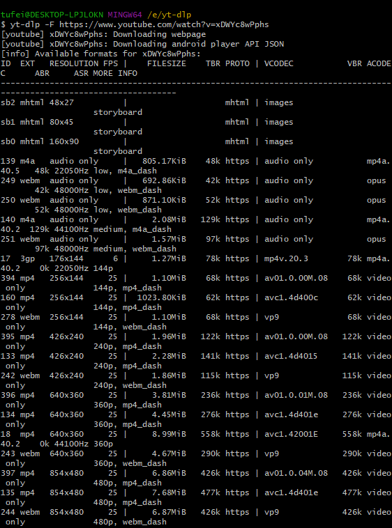

之前下载youtube视频是用Free Download Manager这个软件，非常好用。前段时间发现该软件不能下载Youtube视频了，搜索一下发现可能是遭到了Youtube的反对。找了一下没找到合适的替代品，不得不尝试以前尝试过但放弃了的youtube-dl命令行工具。

倒是不难使用，好多看上去记不住的命令，实际上也用不到。但是发现下载的速度极慢，只有几十上百k/s，属于不能正常使用的级别。可能是用户量太大被Youtube注意到了，只得再度寻找替代品，很快就找到了yt-dlp这个工具。这工具实际上就是另一个youtube-dl，看上去所有命令都一样，但是下载速度还算正常。

#### 安装与使用

Youtube 上的文件是视频与音频分开的，只安装下载工具的话下载下来的是单独的音频与视频文件，所以需要先安装 [ffmpeg]([FFmpeg](https://www.ffmpeg.org/)依赖，并加入环境变量。

之后下载[yt-dlp](https://github.com/yt-dlp/yt-dlp)，其github地址给出了各系统下的安装方法，选择适合自己的方式安装即可。

##### 基础命令

之前尝试这种命令行方式之后放弃的原因就是觉得门槛很高，加上有FDM这样好用的图形化应用，也就没太多动力去学习。这次不得不学习之后才发现，其实看上去命令很多，常用的也就一两句，大部分命令都是有高级需求的人才用得到。

下载之前可以先查看一下视频中包含的文件格格式

```
yt-dlp -F https://www.youtube.com/watch?v=xDWYc8wPphs
```



运行之后会获得该视频提供的所有视频及音频格式，可以通过数字来选择自己所需要的格式，通过数字的组合，下载完成后ffmpeg会自动将音频与视频进行合成。例如我要下载编号为139的音频格式与编号为401的视频格式，则命令为

```
yt-dlp -f "401+139" https://www.youtube.com/watch?v=xDWYc8wPphs
```

也可以简单使用 bestvideo+bestaudio来代替数字。

##### 下载字幕

该工具同时也提供了下载字幕的功能。

```
Subtitle Options:
    --write-sub                      Write subtitle file
    --write-auto-sub                 Write automatically generated subtitle file (YouTube only)
    --all-subs                       Download all the available subtitles of the video
    --list-subs                      List all available subtitles for the video
    --sub-format FORMAT              Subtitle format, accepts formats preference, for example: "srt" or "ass/srt/best"
    --sub-lang LANGS                 Languages of the subtitles to download (optional) separated by commas, use --list-subs for available language tags
```

最后，该工具支持批量下载，可以一次性下载一个视频播放列表中的所有视频，甚至一个频道的所有视频，只要把视频链接替换成对应的视频列表链接或频道链接即可。

总的来说，这种工具看上去对小白比较不友好，但实际上学习成本非常低，并且使用起来及其便利，值得花一点点时间学会。
