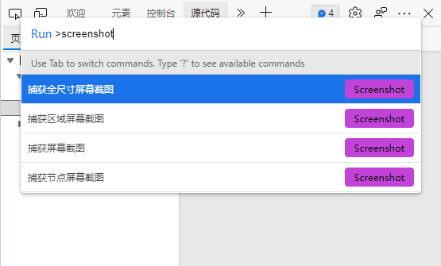

近期需要截一张完整的网页，本想找个支持滚动截图的软件，印象里以前用过一个很轻量级的小工具能实现。搜索一番发现并不需要借助工具，并且截出来的分辨率更高。

具体来说，在chrome里按F12进入开发者模式，然后按 Ctrl+Shift+P进入命令行，输入 screenshot 会自动匹配到所有支持的截图模式。

截图模式包含以下几个：

1. 捕获全尺寸屏幕截图
2. 捕获区域屏幕截图
3. 捕获屏幕截图
4. 捕获节点屏幕截图

自行选择需要的截图方式即可。

此外，进入开发人员工具后，还可以按 Ctrl+Shift+M切换到设备模式，可以选择模拟各种移动设备下的显示效果，并进行截图，实测截出来的图片分辨率相当之不错。

##### 一个思考

通过学习到这个截图小技巧，想到我在很多年前有这种需求时，用的是“滚动截图”这个词来搜索，搜到的方法自然也是真的滚动截图。几年后锤子手机更是把这个说法发扬光大。

现在了解到这种方法，想到对一个事物的命名，或者说描述，很大程度上影响了其实现路径。
