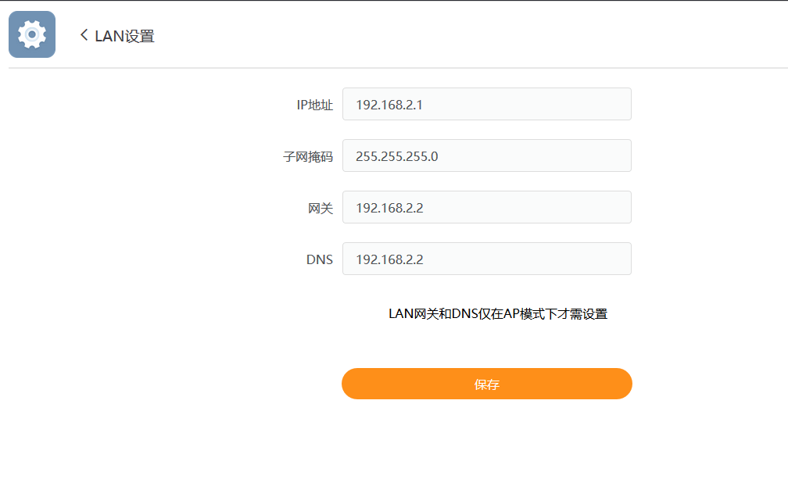
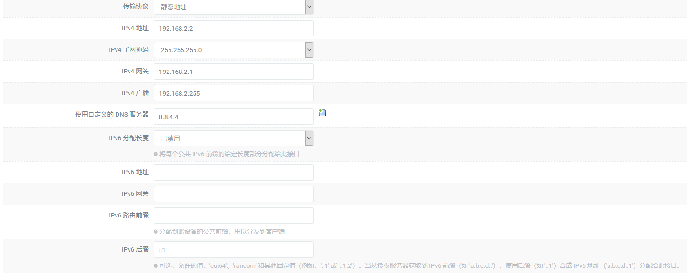
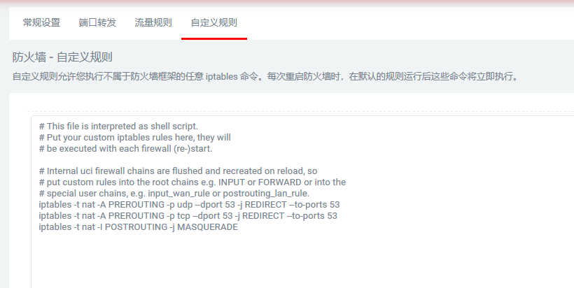
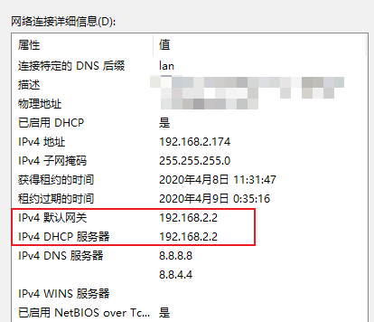

之前为了在电视上看国外的流媒体服务买了个斐讯遗产 K2P，在路由器端使用科学上网服务，用下来感觉还不错。不过 K2P 毕竟性能有限，单纯当家用路由器用着足够，加上科学上网服务就有点难为它了，科学上网测速最多只能测到50Mbps，看 HBO NOW 经常卡顿，于是萌生了使用软路由的想法。

由于对软路由的需求并不强烈，花几百上千块买个工控机显然不合适。对比了一下各种方案，决定选用斐讯的另一个比较火的遗产 N1 盒子，价格便宜功耗低体积小，能塞在电视后面，性能也能满足需求，于是从 PDD 下单。

作为一个小白，刷机过程中走了一些弯路浪费大量时间，如果再给我一次机会我一定选择让商家代刷，年纪大了实在折腾不动。过程不详述了网上教程一大把，主要记录一下旁路由的设置过程，网络结构如图。

主路由K2P方面设置比较简单，主要是关闭DHCP服务器，然后待 N1 设置好之后把 K2P的网关和 DNS 服务器设置成 N1 的IP。当然要是不想设置，只关闭DHCP服务器也是可以的。

接下来是 N1 的设置部分，在 LAN 设置里指定 IP 到 K2P 的同一个 IP 段，我的情况是 K2P 的 IP 为 192.168.2.1，将 N1 设置成了 192.168.2.2。子网掩码 255.255.255.0，IPv4广播 192.168.2.255，网关设置成 K2P 的 IP，DNS设置成 8.8.4.4 或其它常用 DNS 服务器，并启用DHCP。

最后需要在 N1 的防火墙设置里增加一条记录，不明白干啥用的，可能是固件问题。

`iptables -t nat -I POSTROUTING -j MASQUERADE`

设置完成后可能需要重启一下N1，然后看下设备网络的详细信息那里 IPv4网关和DHCP服务器是否已经变成N1的IP地址，至此基本设置成功了。

家里的宽带大约 150Mbps 左右，N1 的性能完全满足需求，科学上网跑满带宽的情况下 CPU 使用率在 15% 左右。

