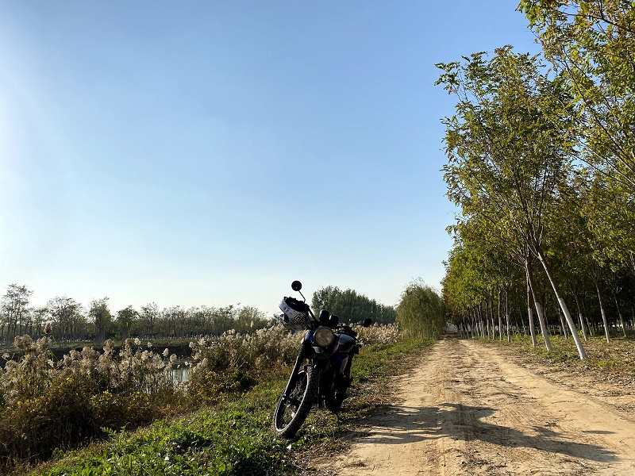
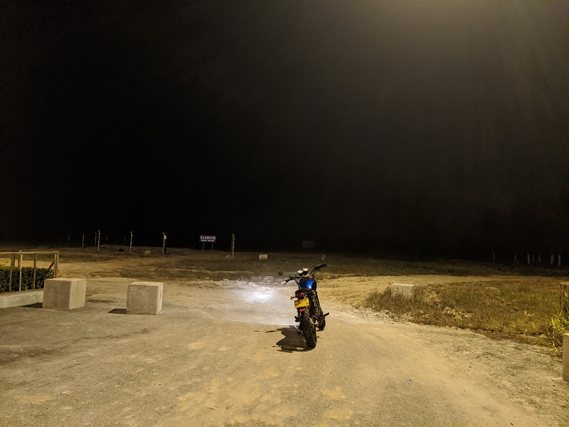
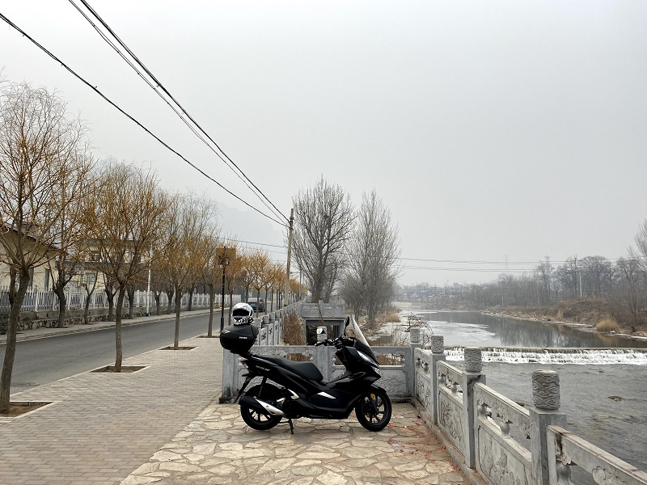
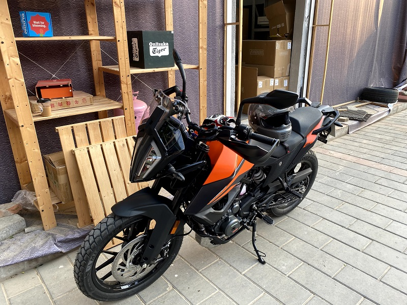
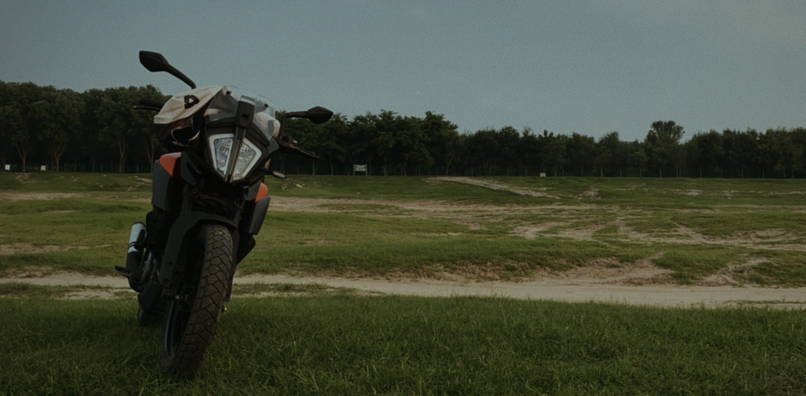
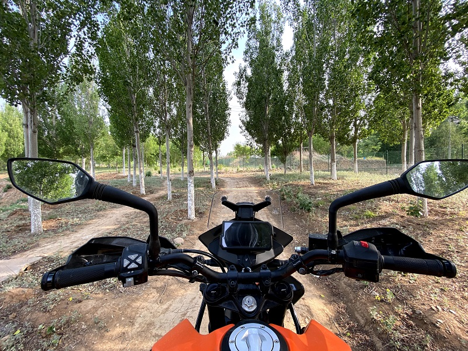
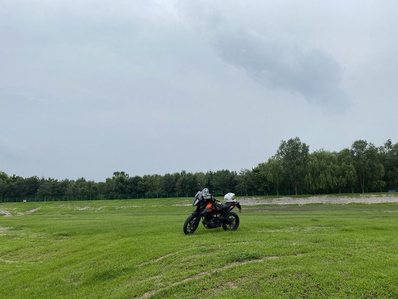
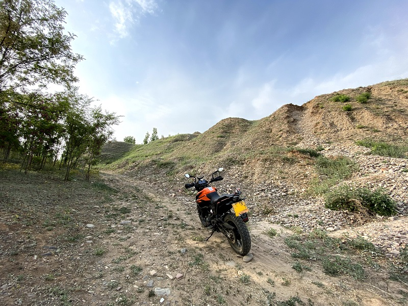
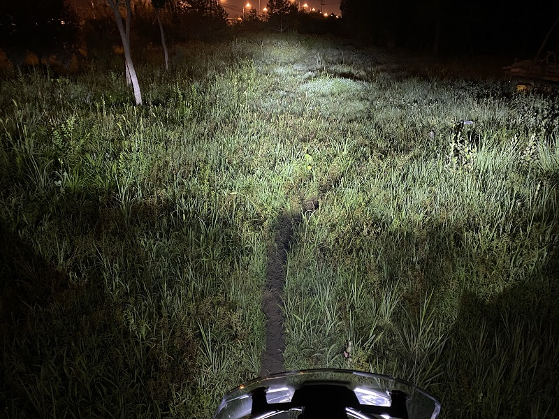

去年总体上来说是比较压抑的一年，工作上的事情几乎使人陷入抑郁，叠加上始于2019年底的疫情，整个2020年都比较难熬。好在经过一番艰难的争取，十月份如期离开上海，倒也没有直接按计划搬到北京，而是选择了生活成本更低的天津，住在南站边上。天津离北京不远，工作需要时可以随时到北京，四舍五入也算回北京了。在疫情影响之下北京的办公室一直没有同事过去，我也无需每天跨城通勤。

在天津的那段时间，对个人精神状态的帮助还是比较大，尽管工作依然令人头秃，好在租住在郊区，每天中午可以去河边晒晒太阳。并且，更重要的是，周末可以在周边骑车玩了。

## 换工作以及买踏板

两个多月以后换了份工作，在年底前搬到北京去了。新工作在所谓的互联网大厂，每天上班打卡，加班严重，大小周等元素一应俱全。好在工作只是累而已，精神压力不像之前那么大了，在新环境中每天学习新东西，对精神状态也有比较好的帮助。

上班初期的一段时间，最难的是每天早上上班坐地铁，由于住得过远，地铁时间超过一个半小时，加上步行时间要一小时50分钟左右的单程通勤时间。加上每天晚上下班非常晚，回到住处通常在十一点以后，早上早起通勤就变得十分难熬。春节假期借了一辆本田pcx150小踏板，骑了一下惊为天人，早上通勤时间缩短为40分钟。几天之后还了车回归地铁，没有对比就没有伤害，这下觉得地铁通勤更艰难了。鉴于天气寒冷还无法去天津把国棍骑回北京，于是让朋友小李在最短的时间内帮我搞一辆二手踏板车，专门用来通勤。也没仔细挑选，选了一辆林海175。

有了这辆踏板之后，通勤不是问题了。3月份搬家到东坝乡，离上班的地方近了不少，骑车通勤只要20分钟左右的时间。另外随着天气转暖，去天津把国棍骑回来也提上了日程。考虑到车子扔在车库一个冬天应该没电了，提前准备好了应急电源以及其它常用工具，在4月初乘火车到天津把国棍骑了回来。

与此同时也在考虑是时候整一辆能够长期骑的摩托车了。对于车型的选择上，一度很纠结。开始因为骑了pxc150，对踏板车的舒适程度和可玩性有了新的认知，想着买一辆 YAMAHA NMAX 155，无奈车厂交不上车，排队时间过长。后来恰逢本田的佛沙350价格发布，想着咬牙买一辆算了，结果本田也交不上车，排队时间更久。从现在往回看的话，当初无奈放弃这两辆车，算是一种幸运吧，不然现在可能在后悔了。

## 骑上心爱的小野驴

最终，经过慎重的思考，在4月中买了一辆 KTM 390 ADV。短短两三个月时间内，从借车骑变为同时拥有三辆车（大雾

懂车的朋友们并不建议我买这辆，劝了我好几次。因为这个车型和品牌，都有一些固有缺点，包括但不限于以下方面：

> 1. 长得丑
> 2. 这辆车本身刚引入国内，尚未有详细评测和车主使用体验，盲买风险高
> 3. 引进国内的版本阉割了减震行程，使得可玩性下降；并且已有消息下半年会引进未阉割版本，届时骑着阉割版很容易后悔
> 4. 价格偏贵，性价比比较差
> 5. KTM作为相对小众的欧洲品牌，在品牌力上弱于日本品牌，车辆保值情况差
> 6. KTM车辆的稳定性，明显弱于日本品牌尤其是本田，车辆保值情况差

我充分听取了朋友们的意见，并结合这些意见去找市面上其它的车型。发现在这个价位上，很难找到一辆比小野驴更合我心意的车。上述缺点都是客观存在的，但是在我愿意或者说能够支付的价格范围内，可能已经没有更好的选择了。

朋友向我推荐了价格稍低的川崎versys300以及宝马G310，这两辆车都没有击中我的买点。

最终还是下单了一辆小野驴。说来惭愧，从初中开始骑车，到现在才第一次买了一辆新车。

## “我知道一条~~近~~后路”

KTM 是以 off-road 系列车型而闻名的，尽管近几年已经成为了一个能力相对全面的车厂。这辆390 adv 算不上什么越野车，尤其是阉割减震之后通过能力变差了，比一般街车强不到哪里去。但是依然，这辆车在没改装的情况下就可以去跑一些轻度的off-road。第一次玩沙子，第一次玩泥巴，是真的很开心。

具体关于这辆车的能力或者体验，就不多谈了，将来骑到足够长的里程数后或许可以专门写一篇类似评测的文章。

有了这辆车以后，我的心态发生了比较正向的变化。具体体现为对人生更看得开，对工作与生活中遭遇的压力更能从容应对了。因为我知道这辆车几乎能带我去任何我想去的地方。就如上面的照片所展示的那样，即使在周末随便去郊外骑骑，也能见到之前见不到的风景。不是说去了多难走的、别的车型走不了的路，而是骑别的车不会去想走这些路。毕竟踏板车和街车不应该干这些脏活儿。

这种对心态的影响，是非常难得的，这辆小野驴对我来说，仿佛是一条后路。长期处在996工作制下，不禁让人去思考人活着的意义是什么，是不是每天浑浑噩噩上班下班，休息时间基本也要被工作消息占据，就是整个人生了，直到35岁或更早被大厂裁员，陷入经济上的困顿。

有了这辆小野驴之后，即使活得再难，只要想一想大不了骑着它出去旅行个把月，就能继续坚持下去了。它存在的意义不是说我能现在就骑着它去远行，而是我想去的时候就可以去。

不知道为何，我在此时想起可能是牧羊少年奇幻之旅里面的一段对话：

> A：你为什么带着一把枪？
> 
> B：它让我能够相信人。

大概刚工作的那年，当大嘴老师骑着他的游侠250去走新藏线，我羡慕地说“我也想骑车去旅行”。大嘴老师轻描淡写地回复了三个字：辞职啊。

许多年过去了，我依然没能成为这样洒脱的人。但现在我知道，我可以成为那样的人了，只是选择了不去成为。

## 走，去玩泥巴！

实际上冬天并没有泥巴可玩，我车子的轮胎也玩不了泥巴，我只是想用这个小标题而已。

写下这些文字的时候，我正在沈阳的一家宾馆里，已经半个多月没有回北京，没有碰摩托车了。猫也只能放在同学家寄养。长期出差，长期熬夜，给身体和精神都带来很多不好的影响。支撑我走下去的信念，就是过段时间回到家，可以把小野驴从地下车库搞上来，骑到附近的野地里去撒个欢。

此时距离我写那篇 [骑车环境愈发艰难](https://shiqingxu.github.io/2019/01/28/%E7%A2%8E%E7%A2%8E%E5%BF%B5/Why-we-ride/) 已经过去近3年，人生发生了挺多变化，当然大部分都是回到北京里这一年中发生的。多亏了能重新开始骑车，不然人生该多么艰难。

## 后记

标准减震行程版本的小野驴已经在前段时间发布上市了，目前来说这个消息并没有使我后悔。毕竟至今，以及短期内，我可能并不会去到什么真正能用到更长的减震的地方，在城市里骑车，坐高低一些反而更好落脚。当有一天我真正需要的时候，也可以花9000块钱换掉前后减震，当然也得换掉轮胎，甚至要换辐条轮。这些事情，也是光期待一下就会让人很开心的。
